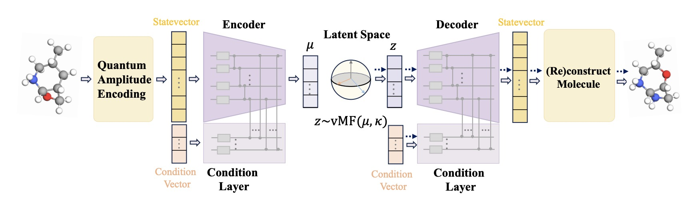

# QVAE-Mole: The Quantum VAE with Spherical Latent Variable Learning for 3-D Molecule Generation

Official implementation for the paper "QVAE-Mole: The Quantum VAE with Spherical Latent Variable Learning for 3-D Molecule Generation" (NeurIPS2024)

https://openreview.net/forum?id=RqvesBxqDo&noteId=F7Zos3tCK9




## Install

1. Clone this repo and setup the environment

```
git clone https://github.com/wuhuaijin/QVAE.git
cd QVAE
conda create -n QVAE python=3.9 -y
conda activate QVAE
pip install -r requirement.txt
```

2. Install the TorchQuantum framework

```
git clone https://github.com/mit-han-lab/torchquantum.git
cd torchquantum
pip install --editable .
```

## Evaluation

```
python generate.py --threshold 0.2 --max_atom 10
```

## Training

```
python main.py --n_qbits 7 --lr 0.01 --kappa 0.1 --threshold 0.2 --max_atom 10
```

## Citation

If you use our code or method in your work, please consider citing the following:

```
@inproceedings{wu2024qvae,
  title={QVAE-Mole: The Quantum VAE with Spherical Latent Variable Learning for 3-D Molecule Generation},
  author={Wu, Huaijin and Ye, Xinyu and Yan, Junchi},
  booktitle={The Thirty-eighth Annual Conference on Neural Information Processing Systems},
  year={2024}
}
```

## Acknowledgement

We appreciate the following works for their valuable code and data:

https://github.com/mit-han-lab/torchquantum

https://github.com/divelab/DIG
